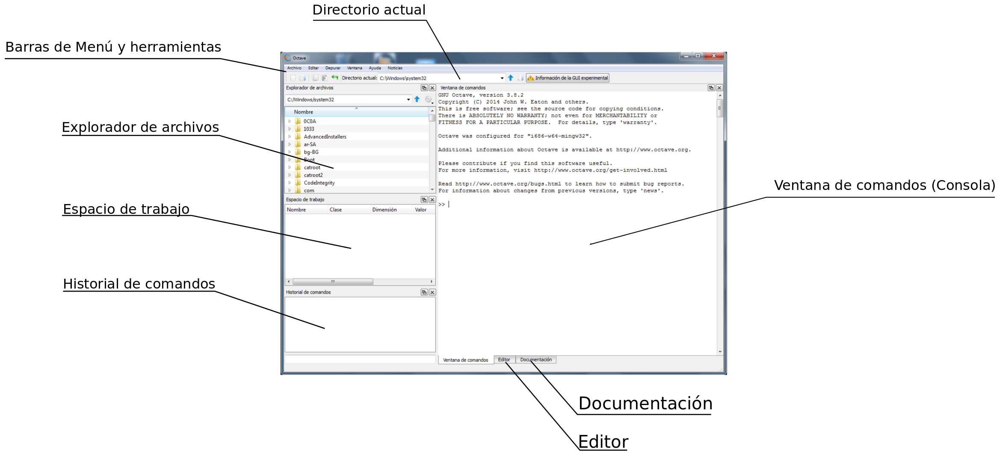

.. intro.rst

Introducción
============

Instalación de Octave 3.8
-------------------------

Durante este curso utilizaremos *Octave* versión 3.8, la última disponible a la fecha de redactar este manual. Es posible que tengas ya instalada otra versión de *Octave* o quizás *Octave-UPM*. Cualquiera de esas aplicaciones te puede servir para seguir el curso, pero te recomendamos la instalación de *Octave* versión 3.8, que trae importantes mejoras respecto de versiones anteriores de Octave. 

Los usuarios de *Matlab* que decidan seguir el curso con *Matlab*, no deberían encontrar problemas. Si surgiera algún tipo de incompatibilidad entre los ejercicios del curso y *Matlab* os agradeceremos que nos lo indiquéis, a través del foro, para ir completando una lista de incompatibilidades, que no será grande, y se tratará más bien de pequeños detalles.

En poco tiempo, seguramente antes de acabar este curso, aparecerá la versión 4.0 de Octave, que traerá todavía más mejoras y correcciones de bugs respecto de versiones anteriores. Os tendremos puntuálmente informados a través del foro de novedades de la asignatura.

Para instalar la versión 3.8 de *Octave* hay que seguir las instrucciones que se dan a continuación, dependiendo del sistema operativo que tengáis instalado en vuestro ordenador.

Los que tengan ordenadores **Mac** con sistema operativo **OSX** pueden seguir las instrucciones que se dan en el `wiki de Octave <http://wiki.octave.org/Octave_for_MacOS_X>`_ [1].

Los usuarios de **Linux** pueden acceder a la página de descagas del `portal web de Octave <http://www.gnu.org/software/octave/download.html>`_ [2] y seguir las instrucciones que se dan allí.

Los usuarios de sistemas operativos **Windows** tienen que utilizar la versión del instalador que se ofrece en la página `http://mxeoctave.osuv.de [3] <http://mxeoctave.osuv.de>`_ para acceder a todas las características de la versión 3.8. Hay que descargar el instalador y ejecutarlo en nuestro ordenador. También ofrecen una versión portable de *Octave*. Portable se refiere a que no requiere instalación. Se puede copiar en una memoria USB, por ejemplo, y ejecutar en cualquier ordenador con sistema operativo Windows.

[1] http://wiki.octave.org/Octave_for_MacOS_X 

[2] http://www.gnu.org/software/octave/download.html

[3] http://mxeoctave.osuv.de/

Primeros pasos tras la instalación
----------------------------------
Si la instalación ha transcurrido normalmente, al final de la misma deberíamos tener unos accesos directos en el escritorio para poder arrancar *Octave* en modo consola o en modo gráfico. Si arrancamos *Octave* en modo gráfico accederemos al *Graphic User Interface* de *Octave*, una de las novedades de la versión 3.8 y que se oficializará en la versión 4.0. En la siguiente figura se muestran las diferentes secciones de la ventana gráfica de *Octave*. (Si ha habido fallos en la instalación leed la nota al final del apartado o plantead las dudas en el foro)

En la parte superior tenemos la **barra del menú principal** que permite acceder a distintas opciones del programa y, debajo de ella, la **barra de botones y herramientas**, que permite acceso directo a algunas de estas opciones. Dentro de esta última es importante el desplegable que nos permite conocer o cambiar el **directorio actual de trabajo**.

Debajo de la barra de herramientas aparecen varias ventanas que vamos a describir:

En la parte izquierda tenemos la ventana del **explorador de archivos** que nos ofrece también un desplegable para el **directorio actual** y una ventana que permite acceder al **arbol de directorios** del ordenador.

Debajo del explorador de archivos está la ventana correspondiente al **espacio de trabajo**. En ella irán apareciendo las variables que tengamos en memoria, a medida que vayamos ejecutando comandos en Octave.

Debajo del espacio de trabajo hay una ventana con el **historial de comandos** tecleados desde el inicio de la sesión. Si queremos volver a ejecutar un comando, no tenemos más que hacer doble click con el ratón sobre él y veremos cómo se ejecuta en la ventana de comandos.

La parte derecha de la ventana de *Octave* está dedicada a la **ventana de comandos** o **consola**, que es el lugar destinado a escribir las órdenes que queramos ejecutar, y donde se nos mostrará la salida de resultados. Esta ventana está tabulada por pestañas o solapas(ver parte inferior), que dan acceso a otras dos ventanas: la ventana del **editor** y la ventana de acceso a la **documentación** de *Octave*. El editor es un editor de texto donde podremos crear y modificar los archivos *.m* de nuestros programas Octave. La pestaña de documentación permite acceder a la documentación de *Octave* en modo local (sin necesidad de acceso a internet).

En la *ventana de comandos*, a la que llamaremos también de manera indistinta *consola*, es donde realizaremos la mayor parte del trabajo. Para poder teclear instrucciones hay que hacer que la ventana adquiera el foco de entrada del usuario pinchando sobre ella. A partir de ese momento el cursor parpadeante nos indicará que está esperando que tecleemos alguna instrucción. El funcionamiento es sencillo: se teclea una instrucción más la tecla *Return* , (*Intro*), y *Octave* responde a través de la misma consola con el resultado de intentar realizar el comando tecleado. Si el comando es correcto nos devolverá el resultado, si no, nos devolverá un texto informando del error detectado por el intérprete de lenguaje de *Octave*.

*Octave* tiene comandos de consola que nos permiten acceder a la información que muestran las ventanas del interface gráfico descritas anteriormente. Es conveniente tener agilidad en la utilización de esos comandos, no limitarse a utilizar las ventanas del interface gráfico.

La ruta del directorio actual de trabajo se puede mostrar en consola con el comando **pwd**. Pruebe a teclear el comando *pwd* en la ventana de comandos. Verá que se muestra la ruta del directorio actual y que coincide con la mostrada en las barras desplegables del interface gráfico.

.. note:: **pwd** es el acrónimo de print working directory

.. note:: **Directorio** es cada una de las divisiones lógicas que se hacen en los sistemas de archivos y que pueden contener otros archivos o directorios. Desde la aparición de los interfaces gráficos para los sistemas operativos se los empezó a denominar también **carpetas** por analogía con las carpetas de los archivos físicos. El icono que se suele utilizar para representar un directorio de un disco es el de una carpeta. En este curso utilizaremos indistintamente las palabras directorio o carpeta para referirnos a ellos. También es habitual la denominación *subdirectorios*, cuando queremos referirnos a los directorios que están contenidos en uno concreto: *'Los subdirectorios del directorio 'programs', que en terminos gráficos serían las carpetas que están contenidas en la carpeta 'programs'*.

El contenido del directorio actual lo podemos mostrar en la consola tecleando el comando **dir** o el comando **ls**, según prefiramos el estilo *windows* o el estilo *linux*. Pruebe una vez más a teclear el comando en la ventana de comandos y a comprobar que el contenido de carpetas y archivos que muestra corresponde al contenido del directorio actual mostrado por la ventana **Explorador de archivos**.

Podemos cambiar el **directorio de trabajo** desde la consola tecleando el comando **cd**, (*change directory*), que admite varias formas de uso:

**cd nombre_directorio**: Cambia el directorio actual al directorio de nombre *nombre_directorio*, que debe ser uno de los subdirectorios del directorio actual.

**cd ruta_completa**: Cambia el directorio de trabajo actual a uno especificado por su ruta completa.

**cd ..**: Cambia al directorio *padre* del directorio actual. El directorio *padre* es el directorio que contiene al directorio actual.

.. tip:: 
	Pruebe a teclear varios cambios de directorios a través de la consola. Conviene ejercitarse en el manejo de la consola para moverse por los discos del ordenador. No solo es eficiente, sino que además es imprescindible en determinados entornos de trabajo en los que no es posible disponer de interface gráfico para Octave. También es importante saber manejar nombres de archivos y sus rutas de acceso a la hora de trabajar en *lectura-escritura* de ficheros. A medida que teclea los comandos de cambio de directorio, observe como cambia el contenido de los desplegables del directorio actual y de la ventana del Explorador de archivos.

Cada vez que teclea un comando en la consola de *Octave* se puede observar como se actualiza el contenido de la ventana **historial de comandos**. En esta ventana se muestran de manera ordenada los distintos comandos tecleados con anterioridad. Se puede volver a ejecutar un comando haciendo doble click sobre él. Para acceder al historial de comandos desde la consola tenemos que teclear el comando **history**, que mostrará un listado de los comandos tecleados con anterioridad, con un número de comando asignado a cada uno de ellos. Podemos ejecutar un comando de la lista tecleando **run_history number**, donde *number* es el número de comando en el listado *history*. Podemos ejecutar los comandos comprendidos entre dos números haciendo **run_history num1 num2**, que ejecutará todos los comandos entre el comando *num1* y el comando *num2*.

.. Note:: Si no se tienen accesos directos al programa tras la instalación se puede intentar lo siguiente:

	- **Localizar el directorio bin de la instalación:** Lo primero que tenemos que hacer es localizar el directorio donde ha quedado instalado el programa. Durante la instalación se nos ofrece instalar en algo parecido a **C:\\Octave\\Octave-3.8.1**. En general será algo parecido a *C:\\Programs\\Octave* o *C:\\Octave* o también *C:\\Archivos de Programa\\Octave*. En cualquier caso, dentro del directorio de la instalación debemos localizar el directorio **bin**, que es donde se encuentran los programas ejecutables de *Octave*. 

	- **Añadir la ruta del directorio bin a la variable path del sistema:** La variable *path* del sistema guarda una lista de directorios separados por *';'*. Estos directorios es donde el sistema operativo busca cada vez que tiene que ejecutar un programa. En el siguiente enlace: `Cómo cambiar el path de Windows <http://blogs.itpro.es/jioller/2011/03/25/cambio-del-path-de-windows/>`_ explican como hacer el cambio. El cambio que hay que hacer es añadir al final de la cadena *path* existente un *';'* y la ruta del directorio *bin* que será algo parecido a *C:\\Octave\\bin*. (ver Nota 1)

	- **Poner en el escritorio accesos directos a *Octave*:** Tenemos que prestar atención a los archivos **octave.exe** y **octave-gui.exe**. Son los programas que arrancan *Octave* en modo consola y en modo gráfico, respectivamente. (*GUI es el acrónimo de Graphic User Interface*). Podemos crear unos accesos directos a ambos programas y tenerlos disponibles en el escritorio, de forma que podamos acceder rapidamente a *Octave*. Para aprender cómo crear accesos directos en Windows podéis consultar el siguiente enlace. **TODO**

