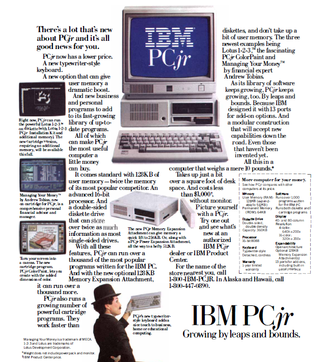
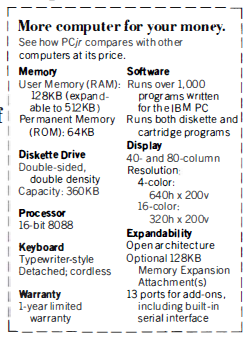

Unidades de medida y orden de magnitud
======================================

Vamos a comenzar el análisis del artículo de Dewdney, y lo vamos a hacer empezando por las 'estampas'. Es curioso ver los anuncios comerciales que aparecen. Se nota el paso del tiempo. Vamos a analizar el anuncio que sale en la cuarta página referente un ordenador IBM que se vendía por aquellas fechas. El artículo es de diciembre de 1984 y el ordenador que se presenta es uno de los pocos ordenadores personales que se podía comprar. 

Pero antes de analizar las características de ese ordenador, vamos a repasar un poco las unidades de medida que se utilizan en informática para medir la información. La unidad básica de medida de la información es el **bit**. Un *bit* es una unidad de información que puede tomar dos valores: **verdadero** o **falso**, que se suelen representar por **1** y **0**, respectivamente. Los ordenadores utilizan grupos de bits durante el procesamiento. Por otra parte, los documentos y programas que guardamos en los dispositivos de almacenamiento están también codificados en agrupaciones de bits para definir los caracteres de que constan. Se definen unas unidades múltiplo del bit para poder medir la cantidad de información. El **byte**, que equivale a ocho *bits*, es la unidad en la que se suelen basar las medidas. 

- **byte** : Un byte son ocho bits. Si lo interpretamos como un número en base binaria puede almacenar un número entero entre 0 y 255. Si queremos considerarlo como un entero que pueda ser positivo o negativo, puede representar un número entre -128 y 127. También podemos representar con un *byte*, un caracter de texto simple (del alfabeto inglés, sin caracteres especiales, ñ, acentuadas, ...).

.. note:: El tipo de datos **int8** de Octave se corresponde con un número entero de un byte de tamaño, pudiendo guardar números enteros entre -128 y 127. Puedes comprobarlo en la consola de Octave tecleando **intmin('int8')** y **intmax('int8')**

- **dos bytes**: Con dos bytes se pueden representar los caracteres y dígitos de los distintos alfabetos existentes, incluyendo todo tipo de caracteres especiales, signos de puntuación, etc. 

.. note:: En Octave existe un tipo de datos denominado **int16** que utiliza dos bytes para el almacenamiento y representa números enteros entre -32768 y 32767. Puedes comprobarlo en la consola de Octave tecleando **intmin('int16')** y **intmax('int16')**

- **kilobyte, kB**: Un kilobyte se utiliza como el equivalente de 1024 bytes (2^10) o de 1000 bytes, según el contexto. A efectos de orden de magnitud nos da igual uno que otro. 

- **4 kilobytes**: El contenido de una página escrita a máquina, equivalente aproximadamente a 25 líneas de 80 caracteres cada una, incluyendo espacios. 

- **Megabyte**: Un *megabyte*, o un **mega** como se suele abreviar, equivale a un millón de bytes. Equivaldría a 250 páginas escritas.

- **Gigabyte**: Un *gigabyte*, o un **giga** como se suele abreviar, equivale a mil millones de bytes, o lo que es lo mismo, mil libros de 250 páginas cada uno.

- **Terabyte**: Un *terabyte*, o **tera** como se suele abreviar, equivale a mil gigas, un millón de millones de bytes, 10^12 bytes, un millón de libros de 250 páginas cada uno.

Volvamos al anuncio del *IBM PC*. En el cuadro resumen de características podemos leer lo siguiente:

- **Memoria RAM:** La memoria RAM es la que está disponible para cargar los programas y datos que ejecuta el ordenador, uno de los cuales es el sistema operativo. Marca la cantidad de información que podemos tener simultaneamente cargada para procesamiento. Es el sitio de donde el procesador coge la información y las instrucciones a ajecutar, y donde deposita los resultados. Cuando se apaga el ordenador, el contenido de la memoria RAM se pierde. El *IBM PC* tenía una memoria RAM de 128 kilobytes, expandible a 512 kB, o sea, el equivalente a 32 folios escritos expandible a 128 folios escritos. El ordenador sobre el que estoy escribiendo estas líneas es un ordenador portátil con 8 gigas de RAM, o sea, el equivalente a ocho mil libros de 250 páginas cada uno, 15625 veces más que la máxima expansión del *IBM PC*.

- **Memoria ROM:** Es una memoria cuyo contenido no se pierde aunque apaguemos el ordenador. Contiene los programas y datos básicos para cargar y poner en funcionamiento el sistema operativo. El *IBM PC* tenía 64 kB de memoria ROM, o el equivalente a 16 folios escritos. El ordenador sobre el que escribo tiene 2560 kB de memoria ROM, 640 folios escritos, 40 veces más que el *IBM PC*.

- **Diskette:** Para almacenar de manera definitiva datos y programas se utilizaban los denominados *diskettes*, que era un disco magnético de 5.25 pulgadas de diámetro. Tenían una capacidad, en aquel momento de 360 kB, utilizando las dos caras del disco. En cada disco se podía guardar el eqivalente a 90 folios escritos. Los discos actuales, denominados *DVD*, tienen capacidades de 4 gigas, o sea, unas once mil veces más.

- **Disco duro:** El ordenador del anuncio no tenía disco duro. Sí que había modelos parecidos con disco duro. Empezaron siendo de 10 megabytes y enseguida pasaron a 20 megabytes. El equivalente a cinco mil folios escritos. El disco duro del ordenador que estoy utilizando tiene 1 **terabyte**, un millón de libros de doscientas cincuenta páginas, cincuenta mil veces más que los discos duros de entonces.

- **Pantalla:** Las pantallas podían trabajar en modo caracteres, similar a la consola de Octave, o en modo gráfico. En el caso de trabajar en modo caracteres se podía utilizar una pantalla 40 o de 80 caracteres de ancho. En el modo gráfico se podían utilizar gráficos de 320x200 puntos, con 16 colores posibles para los puntos, o con gráficos de 640x200 puntos, con un máximo de 4 colores posibles. Las pantallas actuales para ordenadores funcionan siempre en modo gráfico, con resoluciones de 1920x1080 puntos y con 16 millones de colores posibles para cada ppunto.

.. note:: Cada punto iluminado de la pantalla se denomina **pixel**. La *resolución* de una pantalla es el número de puntos que puede dibujar. Hay otro parámetro que marca la calidad y legibilidad de una pantalla, la **densidad de pixels**, que se mide en una unidad denominada **dpi**, *dots per inch*, puntos por pulgada. La unidad de densidad *dpi* es el número de pixels que hay en dos centímetros y medio de ancho de pantalla. No se ve igual una imagen de 100x100 puntos en una pantalla que tenga 10 centímetros de ancho que en una que tenga 20 centímetros de ancho. Los móviles tienen resoluciones de 800x600 pixels, por ejemplo, con una densidad alta, por ejemplo 160 puntos por pulgada, lo que favorece su legibilidad. 

- **Procesador:** El procesador va recibiendo datos a través del llamado *bus* a intervalos marcados por un reloj de frecuencia determinada. El anuncio habla del procesador Intel 8088 de 16 bits, el reloj seguramente tendría 4.77 MHz. En cada impulso del reloj entraban 16 bits al procesador (ver nota). Podríamos establecer un parámetro bits/segundo, resultando que el Intel 8088 procesaba 4.77e6*16= 76.32e6 b/s. El ordenador en el que estoy trabajando tiene un procesador Intel de 64 bits a 2.50GHz. Si calculamos el mismo parámetro tendríamos 2500e6*64=160000e6 b/s, o sea, la capacidad de procesamiento de mi ordenador, medida con este parámetro, es más de dos mil veces la del IBM PC.   

.. note:: En realidad el bus externo del procesador Intel 8088 era de ocho bits, eran los registros del procesador los que eran de 16 bits. (Fuente `Wikipedia <http://en.wikipedia.org/wiki/Intel_8088>`_)

