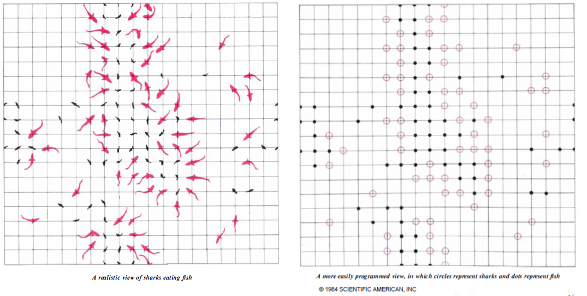

Tiburones y peces: un primer vistazo
====================================

Vamos a echar un primer vistazo al contenido del artículo de Dewdney. Se trata del artículo titulado '*Sharks and fish wage an ecological war on the toroidal planet Wa-Tor*', de A.K. Dewdney, que apareció publicado en la sección *Computer recreations* de la revista *Scientific American* en Octubre de 1984 `[1] <http://www.nature.com/sciam/search/executeSearch?sp-q-1=SCIENTIFICAMERICAN%2CSCIENTIFICAMERICANMIND&sp-q=computer+recreations+celular&sp-c=25&sp-m=0&sp-s=&sp-a=sp1001702d&sp-sfvl-field=subject%7Cujournal&sp-x-1=ujournal&sp-p-1=phrase&sp-p=all&submit=go&pag-end=51>`_. 

El artículo comienza hablando de un planeta imaginario llamado Wa-Tor, con forma toroidal o de donuts y totalmente cubierto de agua. Dice que hay dos especies viviendo en ese océano: tiburones y peces. Lo tiburones se alimentan de peces y los peces tienen siempre comida a disposición. Se trata de realizar un programa que simule los ciclos de alimentación y reproducción de los tiburones y peces y ver como evolucionan las poblaciones.

El programa, al que denominaremos WATOR, plantea una serie de reglas sencillas que gobiernan el comportamiento de los tiburones y los peces. 

Para simular el océano toroidal, se utilizará una rejilla rectangular en la que cada borde esté *lógicamente* conectado con su borde opuesto. Para simular esto, cuando uno de los animales, por ejemplo, se desplace hacia el norte desde una de las casillas de la primera fila, el movimiento le llevará a la casilla situada en la misma columna, pero en la última fila. De la misma forma, un animal que se desplace hacia el este desde una casilla situada en la última columna, aparecerá en la casilla situada en la primera columna de la misma fila. Comportamientos similares se usarán para los movimientos hacia el sur desde la última fila o hacia el oeste desde la primera columna.

El artículo menciona dos versiones diferentes del programa realizadas por el autor y uno de sus ayudantes. En un caso se utilizó una rejilla de 80 puntos horizontales por 23 puntos verticales, y en el otro caso se utilizaron 23 posiciones en horizontal por 14 posiciones en vertical. Con un ordenador actual es posible realizar simulaciones en *océanos* mucho mayores sin problemas. 

Se supone que el tiempo transcurre a intervalos discretos, que el autor denomina **chronos**. En cada *chrono*, WATOR mueve cada tiburón y cada pez. El desplazamiento será a una de las cuatro casillas adyacentes: norte, este, sur y oeste. La casilla se seleccionará al azar. En el caso de los peces, la casilla deberá estar libre, si no hay ninguna libre, el pez no se mueve en ese turno. En el caso de los tiburones el movimiento es un poco más complicado. El programa WATOR seleccionará al azar una de las casillas adyacentes que estén ocupadas por peces. El tiburón se desplazará a ella y devorará al pez. Si no hay casillas ocupadas por peces, seleccionará al azar una de las casillas adyacentes que estén desocupadas de otros tiburones.

El programa WATOR tiene cinco parámetros iniciales que se fijan al principio de cada simulación, y que en la nomenclatura original eran:

- **nfish:** número inicial de peces en el planeta. El programa WATOR distribuirá en el planeta, de una manera aleatoria más o menos uniforme, el número inicial de peces.

- **nsharks:** número inicial de tiburones en el planeta. El programa WATOR distribuirá en el planeta, de una manera aleatoria más o menos uniforme, el número inicial de tiburones.

- **fbreed:** número de chronos que deben transcurrir para que un pez tenga descendencia. Los peces dan lugar a la aparición de un nuevo miembro de la especie, al sobrevivir al número de ciclos indicado por *fbreed*.

- **sbreed:** número de chronos que deben transcurrir para que un tiburón tenga descendencia. Los tiburones dan lugar a la aparición de un nuevo miembro de la especie, al sobrevivir al número de ciclos indicado por *sbreed*.

- **starve:** número máximo de chronos que un tiburón puede  estar sin comer. Si un tiburón está un numero de crhonos superior a *starve* sin comer, el tiburón muere y desaparece. Los peces se supone que tienen siempre comida.

Hasta aquí el planteamiento del problema. El resto del artículo se dedica a explicar como resolverlo. En las próximas semanas también nosotros iremos desgranando la solución del problema. Entre tanto, podéis ir meditando a cerca de cómo se podrían plantear las distintas partes del problema para resolverlo con Octave, que es nuestro objetivo. También podéis echar un vistazo a cómo lo resuelve Dewdney, leyendo el resto del artículo.

