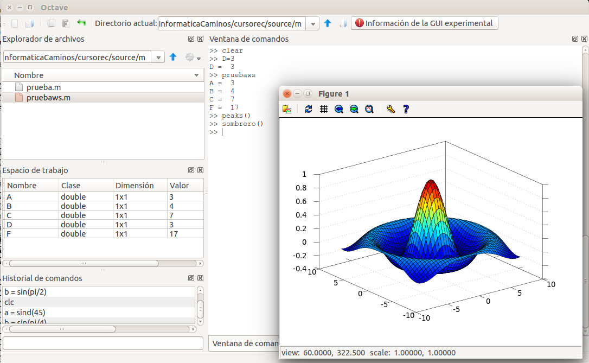

% tipsoctave.rst

Tips and tricks Octave 1
========================

Comprobación de gráficos
------------------------

Una vez instalado Octave conviene comprobar que funciona adecuadamente el sistema de gráficos. Octave ofrece dos funciones utilitarias para ese fin: *peaks()* y *sombrero()*. Prueba a utilizar ambas funciones, el resultado de lla función *peaks()* debería ser parecido al de la figura siguiente:

.. image:: _static/peaks.png
   :width: 600px
   :alt: peaks function

Y a continuación el resultado de ejecutar la función *sombrero()*:

