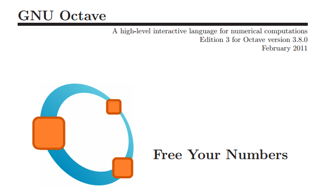

Tips Octave 2: Octave en las redes sociales
===========================================

La presencia de Octave en las redes sociales permite interactuar a la comunidad de usuarios de Octave, compartiendo experiencias, recursos y soluciones de problemas comunes. Repasamos a continuación algunos de los perfiles sociales de Octave en la Web:

- **Portal de Octave:** El primer sitio de referencia para Octave es el portal oficial de Octave en `[1] <http://www.gnu.org/software/octave/>`_. En este portal es donde tendremos a disposición las últimas versiones estables de Octave para los distintos sitemas operativos. Es el lugar donde está la documentación oficial de Octave. Podemos acceder a la documentación oficial a través de la red, en formato html, en `[2] <http://www.gnu.org/software/octave/doc/interpreter/index.html>`_ o en formato pdf para descargar en `[3] <http://www.gnu.org/software/octave/octave.pdf>`_.

- **Lista de correo:** Existe una lista de correo en la que los usuarios de Octave plantean las dudas que les surgen y otros usuarios, o los propios desarrolladores ayudan a resolverlas. También se anuncian en la lista todas las novedades acerca de nuevas versiones, actualizaciones de los paquetes, etc. Cualquiera puede suscribirse a la lista de correo en  `[4] <https://lists.gnu.org/mailman/listinfo/help-octave>`_. El histórico de mensajes de la lista se puede consultar en `[5] <http://lists.gnu.org/archive/html/help-octave/>`_

- **Twitter:** La cuenta de twitter **@GNUOctave**, no oficial, es una cuenta que tuitea acerca de novedades y recursos relacionados con Octave. No tiene mucho movimiento, pero es interesante mirar el histórico de tuits, pues tiene una buena colección de trucos, portales interesantes y demás. Puedes acceder al perfil de *@GNUOctave* en `[6] <https://twitter.com/GnuOctave>`_.

- **Facebook:** También hay una página en *Facebook* dedicada a Octave. No publican posts, pero tiene una buena lista de recursos relacionados con Octave. La página se puede consultar en `[7] <https://www.facebook.com/pages/GNU-Octave/104034979634043?fref=ts>`_

- **Linkedin:** También encontramos varias páginas en Linkedin dedicadas a usuarios de Octave. Un ejemplo lo puedes ver en `[8] <https://www.linkedin.com/groups?home=&gid=4044339&trk=anet_ug_hm>`_

- **Google+:** En Google+ podemos acceder al perfil de GNU OCtave en `[9] <https://plus.google.com/u/0/115085835259570491111/posts>`_

[1] `Portal de Octave <http://www.gnu.org/software/octave/>`_

[2] `Documentación WEB Octave <http://www.gnu.org/software/octave/doc/interpreter/index.html>`_

[3] `Documentación de Octave en pdf <http://www.gnu.org/software/octave/octave.pdf>`_

[4] `Lista de correo de usuarios de OCtave <https://lists.gnu.org/mailman/listinfo/help-octave>`_

[5] `Histórico de mensajes de la lista de correo de Octave <http://lists.gnu.org/archive/html/help-octave/>`_

[6] `Perfil en Twitter de @GNUOctave <https://twitter.com/GnuOctave>`_

[7] `Página Facebook de GNU OCtave <https://www.facebook.com/pages/GNU-Octave/104034979634043?fref=ts>`_

[8] `Linkedin Octave users and developers <https://www.linkedin.com/groups?home=&gid=4044339&trk=anet_ug_hm>`_

[9] `Google+ GNU OCtave <https://plus.google.com/u/0/115085835259570491111/posts>`_

