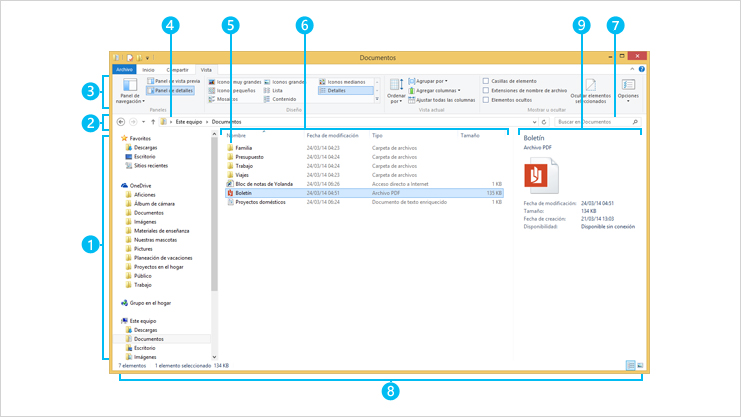

Tips and tricks del sistema operativo 1
=======================================

El explorador de archivos
-------------------------

La labor de programar y la utilización del ordenador en general, salvo el caso del usuario ocasional, requieren de un manejo intensivo del sistema de archivos. Hay que saber cómo crear, modificar, mover o eliminar archivos y carpetas. Conviene conocer las carpetas que el sistema operativo destina a determinados fines concretos y en qué lugares conviene o no conviene guardar o modificar las cosas. Para todas estas tareas es habitual utilizar el explorador de archivos. En la siguiente imagen mostramos el explorador de archivos que viene por defecto en las distribucioness Linux Ubuntu, y que se llama *Nautilus*:

.. image:: _static/nautilus.png
   :width: 500px
   :alt: explorador

En esta otra imagen se muestra el explorador de archivos que viene con las últimas versiones de Windows:

Para saber más acerca de cómo manejar el explorador de archivos de la versión 8 de Microsoft Windows puedes consultar el siguiente enlace:

`http://windows.microsoft.com/es-es/windows-8/files-folders-windows-explorer <http://goo.gl/yoToJo>`_

Existen muchas alternativas al explorador que viene por defecto en Windows. En el siguiente artículo tienes 20 alternativas al explorador de archivos:

`http://www.emezeta.com/articulos/alternativas-al-explorador-de-windows <http://goo.gl/UMX9XU>`_

Los usuarios de sistemas Linux también disponen de numerosas alternativas. En el siguiente artículo se muestran 14 de ellas:

`http://www.muylinux.com/2009/01/07/14-exploradores-de-ficheros-para-linux <http://goo.gl/5sijSi>`_

Otra alternativa interesante es acceder al sistema de archivos a través de la consola, lo que trataremos en otro momento.

Nombres de archivos y extensiones de nombre
-------------------------------------------

En el sistema operativo Windows la extensión del nombre de archivo, los tres caracteres finales tras el punto, determina el tipo de archivo y lo que se puede hacer con él. Hay archivos **ejecutables** que son los que al abrirlos arrancan un programa. Estos archivos tienen la extensión **.exe**. Los archivos ejecutables suelen tener una serie de archivos asociados que contienen las librerías de procedimientos que utilizan, lo que en otro lugar hemos llamado sus *dependencias*. Estas librerías de procedimientos suelen llevar la extensión **.dll**, (Dynamic Link Library, Librería de Enlace Dinámico). Otros archivos tienen otras extensiones. Los archivos de scripts y funciones de Octave tienen la extensión **.m**.

En general, el sistema operativo Windows asocia una determinada extensión de archivo con los programas que utilizan ese tipo de archivos. También asocia a cada extensión un icono, que es el que sale en el explorador. Estas asociaciones las podemos configurar o modificar. Para saber más acerca de los nombres de archivos y de las extensiones de nombre puedes consultar la documentación de Microsoft en el siguiente enlace:

`http://windows.microsoft.com/es-es/windows/file-names-extensions-faq#1TC=windows-7 <http://windows.microsoft.com/es-es/windows/file-names-extensions-faq#1TC=windows-7>`_

.. note:: El explorador de Windows tiene activada por defecto una opción que oculta la extensión de los archivos que llama *conocidos* al mostrarlos en el explorador. Es conveniente desactivar esa opción, y que podamos ver las extensiones de los nombres de archivo listadas. En el siguiente enlace puedes consultar cómo modificar el comportamiento por defecto del explorador de archivos de Windows:

	`http://windows.microsoft.com/es-es/windows/show-hide-file-name-extensions#show-hide-file-name-extensions=windows-7 <http://windows.microsoft.com/es-es/windows/show-hide-file-name-extensions#show-hide-file-name-extensions=windows-7>`_

