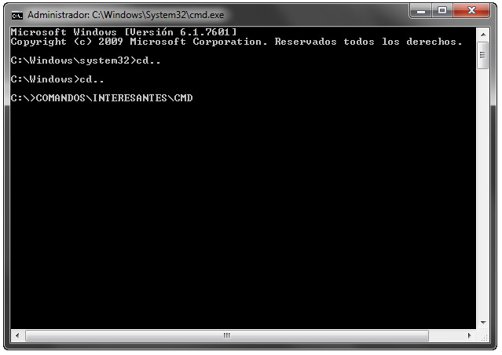

Tips and tricks del sistema operativo 2
=======================================

La consola del sistema operativo
--------------------------------

Todos los sitemas operativos nos ofrecen una consola para acceder a las operaciones del mismo. El aspecto es similar en todos: una consola de texto, con un prompt esperando la entrada de un comando. Las respuestas a los comandos tecleados se muestran a través de la misma consola.

Pensar en las consolas como la forma antigua de utilizar el ordenador, por contraposición a la utilización a través de los interfaces gráficos basados en ventanas y utilización del ratón es un error. La consola es un método más eficiente de realizar determinadas tareas. En algunos sistemas incluso es la única manera de acceder al computador. Lo que sucede es que la curva de aprendizaje de la consola es mayor, y su uso se suele limitar a los usuarios medios y avanzados. 

Los programadores deben realizar un uso intensivo de los sistemas de archivos, y es conveniente que conozcan al menos algunos comandos básicos de consola. 

Los usuarios de Linux disponen de consolas muy potentes que permiten hacer cualquier cosa que se pueda hacer con el ordenador.

En Windows 7 podemos accedera la consola mediante **Inicio> Todos los programas> Accesorios> símbolo del sistema**. También mediante la barra de búsqueda o archivos del menú de inicio introduciendo “**cmd**” o “**símbolo del sistema**”. Pulsando en ellos con el botón derecho del ratón podemos elegir el acceso en modo usuario o administrador. En Windows 8, el acceso más sencillo lo encontramos en el menú de usuario haciendo clic secundario en el botón de inicio.

Puedes echar un vistazo al siguiente artículo que habla de cómo acceder a la consola y cómo utilizar algunos de sus comandos en un sistema operativo Windows.

`Comandos CMD, la consola de Windows también existe <http://www.muycomputer.com/2014/07/30/comandos-cmd>`_

El path del sistema
-------------------

**PATH** es una variable de entorno de los sistemas operativos. El contenido de la variable *path* es una lista de directorios. Estos directorios son las rutas en las cuales el intérprete de comandos debe buscar los programas a ejecutar. Cada vez que ordenamos ejecutar un comando, el sistema operativo buscará el programa correspondiente en el directorio actual y en la lista de directorios que hay guardada en la variable *path*.

Para que funcionen bien algunos programas es necesario incluir su directorio en la variable *path*. Es el caso de Octave. 

.. note:: El interprete de Octave también tiene su propia variable *path*, que es una lista de directorios donde buscará los ficheros *.m* que ordenamos ejecutar desde la consola. Podemos ver el contenido de la variable *path* del interprete de Octave tecleando *path* en la consola. También podemos modificar la variable *path*. Para conocer más acerca del uso de la función *path()* teclea en consola *help path*.

